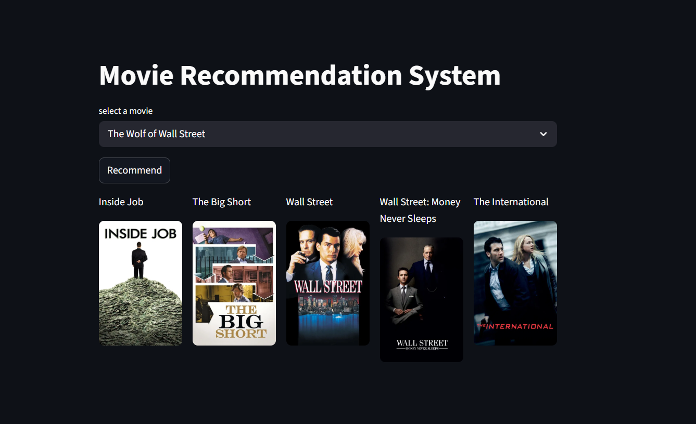

# Movie Recommendation System

## Overview

This project is an ML-powered movie recommendation system that suggests movies to users based on their preferences.

The system takes a previously watched movie's title as input and recommends top 5 movies 
similar to the input title.

---

## Objective

The goal of this project is to:
- understand the end-to-end ML pipeline
- gain practical experience building a real ML project
- learn how ML systems are structured and deployed

This project also helps in improving important ML and software development skills such as:
- Data Preprocessing
- Data Cleaning
- Exploratory Data Analysis (EDA)
- Feature Engineering
- Model Training
- Model Evaluation
- Deployment

---

## Input

The user inputs the title of a previously watched movie he/she has watched before.

---

## Output

The system recommends:
- similar movies
- movies with related genres/themes
- movies with similar characteristics

---

## Tech Stack

- Python
- NumPy
- Pandas
- Matplotlib
- Seaborn
- Scikit-learn
- Streamlit

---

## Workflow

1. Load the movie and credits datasets.
2. Merge both datasets into a single dataframe.
3. Clean and preprocess the data.
4. Combine important textual features into a new column called `tags`.
5. The `tags` column acts as a consolidated representation of each movie’s metadata.
6. Apply stemming to reduce similar words to their root forms.
7. Use CountVectorizer to convert text data into numerical vectors and create a vocabulary of keywords.
8. Compute the cosine similarity matrix to measure similarity between movies.
9. Retrieve the top 5 most similar movies based on similarity scores.

## Application Demo

